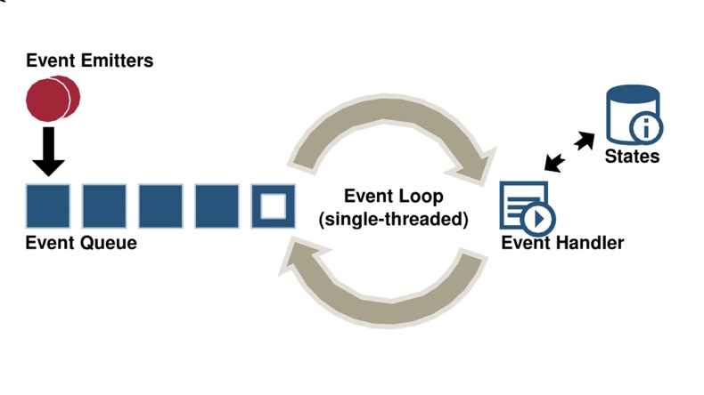

#Promise前世今生

###浏览器事件模型
   
   在浏览器中，JavaScript作为单线程运行；另外，对UI线程操作的安全性考虑，JavaScript和UI线程也处于同一个线程中。因此对于长时间的耗时操作，将会阻塞UI的响应。为了更好的UI体验，应该尽量的避免JavaScript中执行较长耗时的操作或者是长时间I/O阻塞的任务。所以在浏览器中的大多数任务都是异步（无阻塞）执行的。在HTML5中引入了新的组件-Web Worker，它可以在JavaScript线程以外执行这些任务，而不阻塞当前UI线程。 
   
   浏览器中的事件循环模型 
   
   
    
   
   由于浏览器的这种内部事件循环机制，JavaScript以callback回调的方式来处理事件任务。因此无所避免的对于多个的JavaScript异步任务的处理，将会遇见”callback hell"，使得这类代码及其不可读和难易维护,在视觉上，回调金字塔会让你的代码最终超过屏幕的宽度。***更重要的的是，callback剥夺了return 和throw能力，剥夺我们在栈上执行代码的能力。
   
   
   
###Promise从天而降

   Promiese解决 多异步callback问题而诞生，解决了代码缩进的问题 
   ***那什么是Promise呢?***  
   Promise在英语中语义为：”承诺“，它表示如A调用一个长时间任务B的时候，B将返回一个”承诺“给A，A不用关心整个实施的过程，继续做自己的任务；当B实施完成的时候，会通过A，并将执行A之间的预先约定的回调。而deferred在英语中语义为：”延迟“，这也说明promise解决的问题是一种带有延迟的事件，这个事件会被延迟到未来某个合适点再执行。 
   
   [漫画解读Promise](http://andyshora.com/promises-angularjs-explained-as-cartoon.html)
###Promise结构  

   [Promise设计规范](https://promisesaplus.com)--(https://promisesaplus.com) 
   
   1.Promise 对象有三种状态： Pending – Promise对象的初始状态，等到任务的完成或者被拒绝；Fulfilled – 任务执行完成并且成功的状态；Rejected – 任务执行完成并且失败的状态； 
   
   2.Promise的状态只可能从“Pending”状态转到“Fulfilled”状态或者“Rejected”状态，而且不能逆向转换，同时“Fulfilled”状态和“Rejected”状态也不能相互转换； 
   
   3.Promise对象必须实现then方法，then是promise规范的核心，而且then方法也必须返回一个Promise对象，同一个Promise对象可以注册多个then方法，并且回调的执行顺序跟它们的注册顺序一致
   
   4.then方法接受两个回调函数，它们分别为：成功时的回调和失败时的回调；并且它们分别在：Promise由“Pending”状态转换到“Fulfilled”状态时被调用和在Promise由“Pending”状态转换到“Rejected”状态时被调用。 
   
   Promise流程图如下: 

   

Promise将原来回调地狱中的回调函数，从横向式增加巧妙的变为了纵向增长。以链式的风格，纵向的书写，使得代码更加的可读和易于维护。

###Promise高级技巧要点
1.多个异步任务的串行处理
2.多个异步任务的并行处理
3.统一调用接口
4.延迟任务的Promise DSL语义化封装
5.利用Promise来实现管道式[AOP拦截](https://en.wikipedia.org/wiki/Aspect-oriented_programming)

###Promise使用JS常见错误

[移步这里](http://efe.baidu.com/blog/promises-anti-pattern/)---(http://efe.baidu.com/blog/promises-anti-pattern/)

###期待
  
 不错的iOS--PromiseKit框架，[传送门](https://github.com/mxcl/PromiseKit)--(https://github.com/mxcl/PromiseKit) 
 
 [JS库看这里](https://github.com/calvinmetcalf/lie)--(https://github.com/calvinmetcalf/lie)
  
  
 ***下一篇，读源码，学习设计 iOS端的Promise***

###参考文档

1.[MSN](https://developer.mozilla.org/en-US/docs/Web/JavaScript/Reference/Global_Objects/Promise)

2.[promise设计规范](https://promisesaplus.com)

3.<http://www.cnblogs.com/whitewolf/p/promise-best-practice.html>

4.<http://andyshora.com/promises-angularjs-explained-as-cartoon.html>
   